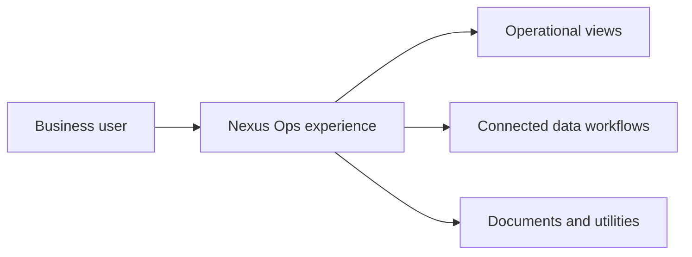

### N E X U S &nbsp; D Y N A M I C S

# NEXUS OPS
### A clearer view of business operations.

**Operations intelligence · Connected workflows · Flutter**

**A public look at the product. A private implementation.**

---

## Overview

**Nexus Ops** is the business operations product within the **Nexus Dynamics** portfolio. Its direction is a unified, approachable workspace for organizing business information and operational workflows.

The product brings together mobile-first interaction, cloud-connected services, and document-oriented utilities. This public repository serves as its **portfolio and product showcase**; the proprietary application source stays private.

> **Repository type:** Public product documentation only. No runnable app source, secrets, or private cloud configuration is published.

## Product focus

| | Area | Intended experience |
|:--:|---|---|
| ◉ | **Operations overview** | A central place for business activity and operational visibility. |
| ▦ | **Connected records** | Workflows designed around structured, cloud-connected information. |
| ◇ | **Account access** | Authentication and account-connected experiences. |
| ▣ | **Documents** | Support business-ready PDF and printing workflows. |
| ↗ | **Media & utilities** | Incorporate image selection and useful on-device capabilities. |
| ⟡ | **Interface quality** | Present operational complexity in a cleaner, more usable UI. |

*These sections describe product direction; the uploaded project configuration does not verify every workflow as implemented or deployed.*

## Technology snapshot

Based on the supplied Flutter project manifest:

| Layer | Technologies |
|---|---|
| **Application** | Flutter · Dart |
| **Interface** | Google Fonts · smooth_page_indicator |
| **Cloud data** | Firebase Core · Cloud Firestore |
| **Identity** | Firebase Authentication · Google Sign-In |
| **Networking** | http |
| **Documents** | pdf · printing · path_provider |
| **Local utilities** | shared_preferences · image_picker |

### High-level experience

*Conceptual product map, not a verified production architecture diagram.*

## Design principles

- **Useful at a glance:** prioritize information that helps users act.
- **Calm visual hierarchy:** clear surfaces, consistent typography, and purposeful spacing.
- **Connected by design:** plan for data-aware, role-appropriate workflows.
- **Practical output:** support real business documentation needs.
- **Mobile-first thinking:** create an experience that remains approachable on smaller screens.

## Product previews

Approved, real screenshots of the application can be added here. None are included yet because the current upload contains configuration files, not the UI image assets or Dart screen implementations.

## Repository access

| Public here | Kept private |
|---|---|
| Product concept and identity | Flutter / Dart source code |
| High-level capabilities | Application internals |
| Technology overview | Cloud keys and environment files |
| Approved product visuals | Sensitive integrations and operational data |

**The public repository is a showcase, not the distributable application.**

---

**NEXUS OPS** · A Nexus Dynamics project

*Connect the work. See the bigger picture.*

[Explore the developer profile](https://github.com/yashransubhe-prog)

